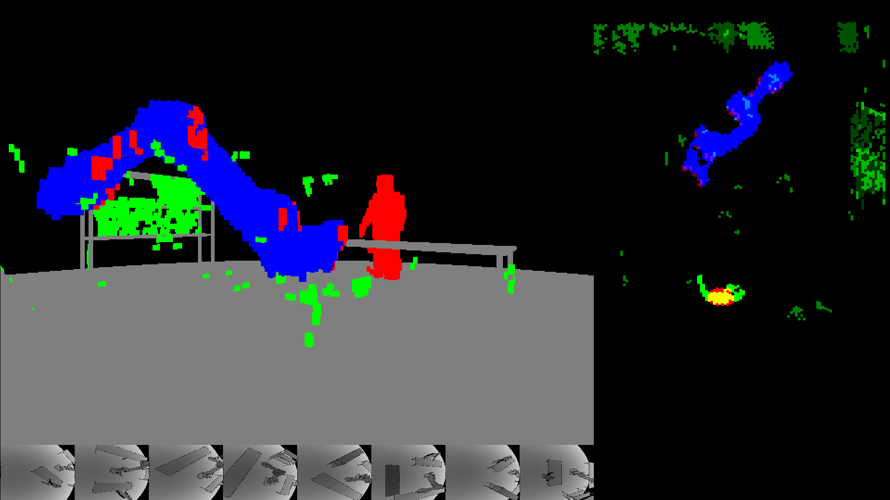
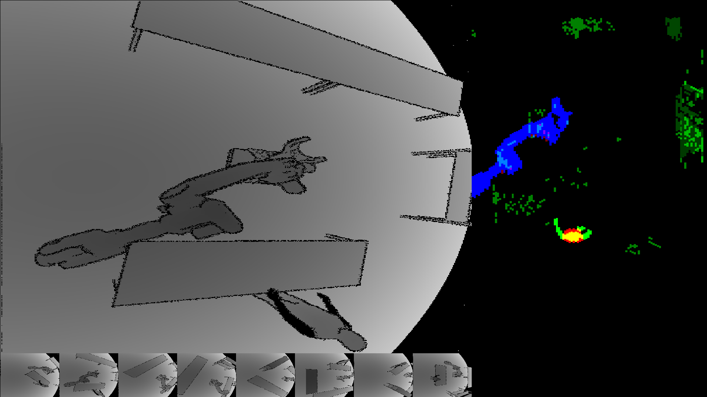

This is a system that uses images from time-of-flight cameras to track robots and people
and also a simulation platform for experimenting with that sort of thing.

The main idea for efficiency is that most of the volume seen by the cameras is empty, so we
want to spend as little time as possible on empty voxels.  Once a voxel has been
determined to be empty we do not want to visit it again.  This is reflected
in two ways.  The first is that when incorporating a
pixel depth from a new image we only examine the voxels that lie between the
new measurement and the previous one.   The other is that the reconstructed
3D scene is represented as a set of vertical intervals of non-empty voxels.
Empty voxels are only represented by their absence.

## Screen shots

Here is a screenshot of the perspective display.

The scene contains a robot, a person, and some tables and shelves.
There are eight camera image thumbnails along the bottom and a top-down map at the upper right.
The voxels are 5cm on a side.
In the perspective view
gray voxels are unmoving background objects, including the robot's base, and blue are the
robot's position as derived from its joint angles.  Small chunks of unoccupied voxels are green
and large chunks are red.  The cameras' (simulated) 'floating pixels' along discontinuties
result in a scattering of unidentified voxels.
The top-down map can show different views of the voxel data.  Here is shows the types of
voxels in each column.

Here is a second screenshot showing a full camera image.

The person's sleeves are treated as if they were invisible
to the camera's wavelength, which is true of some materials.

There is also an [MP4 capture](./screenshots/demo.mp4). 

## What's in the box

Besides some test apps, there are four executables.

### `core/core`
This is the main app.  It receives depth images from `sim/sim` and does the 3D reconstruction.
It currently also runs the GUI, but I am in the process of separating that out.

### `sim/sim`
This generates the simulated images.  It receives scene data (robot joint positions,
avatar position, and so on) from the GUI part of `core/core`.
The generated images are send to `sim/sim` using UDP.  This app is also used to create the background depth images used by `static/voxel-data-app`.

### `static/voxel-data-app`
This calculates which voxels each pixel of each camera sees.  The results are
saved in a file for use by `core/core`.  Background images created by `sim/sim`
are used to ignore voxels occupied by fixed objects in the scene.

### `static/mesh-app`
This creates the STL files for the test scene.

## Simulation

I do not have any time-of-flight cameras or industrial robots.  The code runs using
simulated images that include a robot and a human avatar.  There is a GUI that shows 
the simulated images, as well as a perspective reconstruction of the scene from
the images.  It also has a number of debugging features, including:
* moving the robot and avatar
* aiming the cameras
* changing the perspective viewpoint
* placing objects to obscure the cameras' views
* viewing different details of the 3d reconstruction

### Camera Simulation

The simulated camera parameters are based on the Terabee 3Dcam VGA.  The key specifications are:
* 640 pixels × 480 pixels (VGA)
* 0.35 m to 5 m range
* up to 30 frames per second
* field of view is 90° × 67.5°
* range accuracy is 1-2%
I have not found any detailed evaluation of its performance. There are papers
on Microsoft's Kinect, which uses similar technology, but the details matter.
I do simulate the camera removing 'floating pixels', where pixels on a
discontinuity can read as being anywhere between the two values.
The camera software removes these pixels from the images, so the simulation
does as well.  This is why the edges of things appear black in the depth image above.

### Robot Simulation

The robot is a simulated ABB IRB 6700 using the URDF and mesh files are from here:
https://github.com/ros-industrial/abb_experimental/tree/kinetic-devel/abb_irb6700_support

## Performance

My laptop has eight threads (four cores).  When running with eight simulated cameras, the code uses one thread
for the simulation, one thread for predicting robot positions, and four threads for image processing.  This
leaves two for everything else.  Running this way reconstructing a scene from eight images takes about 15ms
on my laptop.

## Files

There are a number of other files containing utilities, experiments, etc.

- scene reconstruction
  - core/main.cpp               main loop for scene reconstruction
  - core/blob.cpp               blob data structure (a blob is a connected set of occupied voxels)
  - core/fusion.cpp             construct the set of blobs from the image data

- GUI
  - core/display.cpp            GLFW code for the GUI
  - core/render.cpp             draw a perspective view of the blobs

- precomutation of voxel data
  - static/voxel-data-app.cpp   reads in background images and writes out voxel data
  - static/voxel-data.cpp       determine with camera rays hit which voxels (uses util/raster.cpp)

- simulation
  - sim/main.cpp                main loop for the simulation app
  - util/raster.cpp             create camera images from triangle meshes
  - robot/robot.cpp             calculating a robot's pose from joint angles
  - robot/urdf.cpp              reading unified robotics description formaf (URDF) files
  - static/mesh-app.cpp         generating STL files for backgrounds and objects

- communication
  - camera/camera.cpp           sending and receiving depth images
  - util/command.cpp            the core and simulation communicate via serial commands
